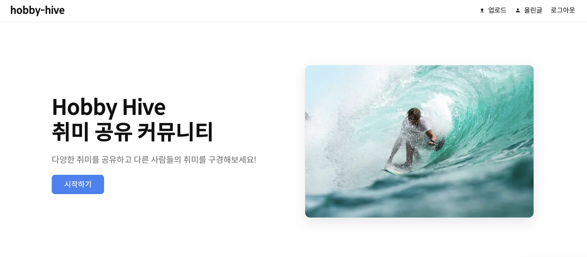
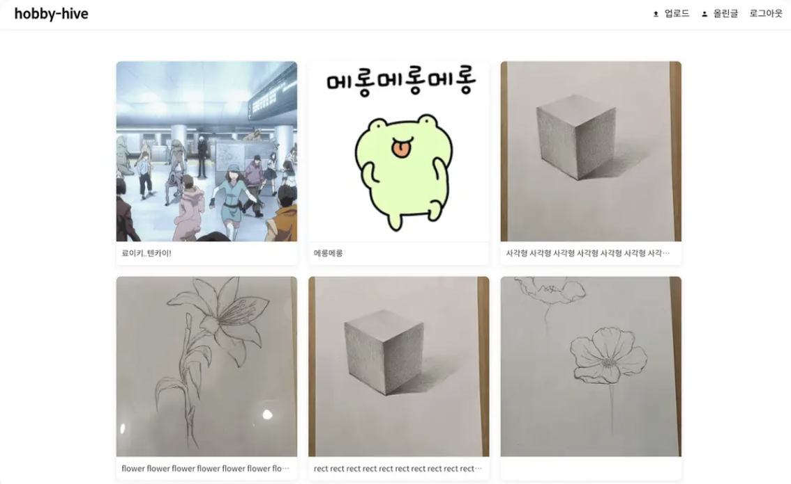
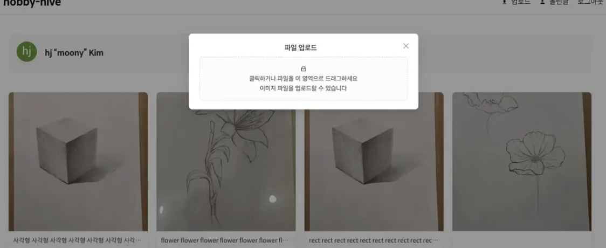
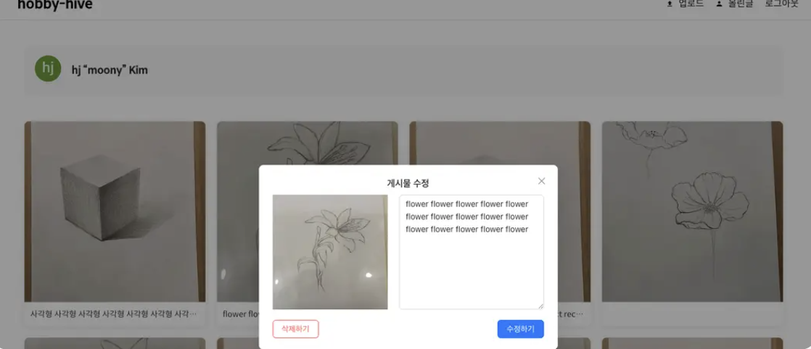
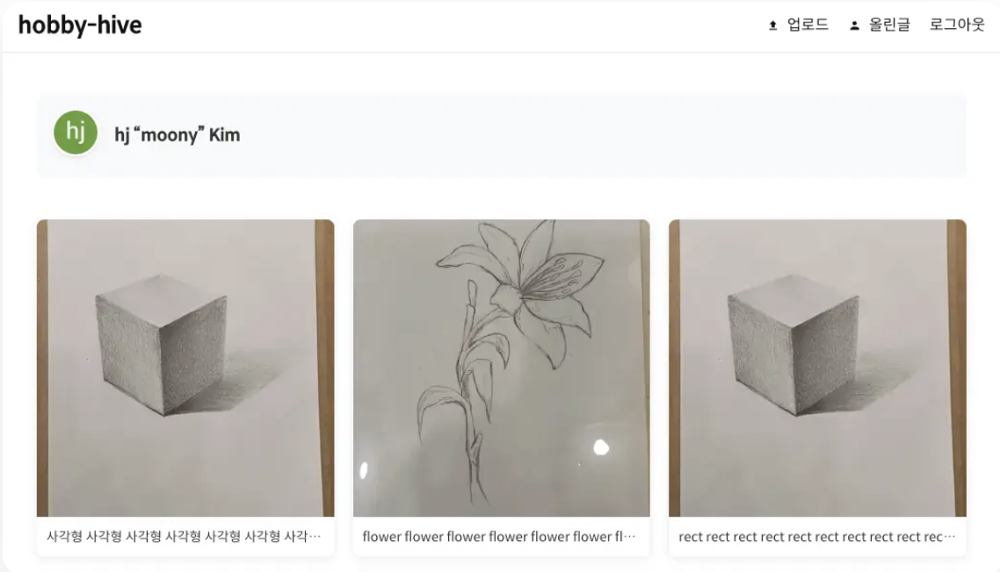
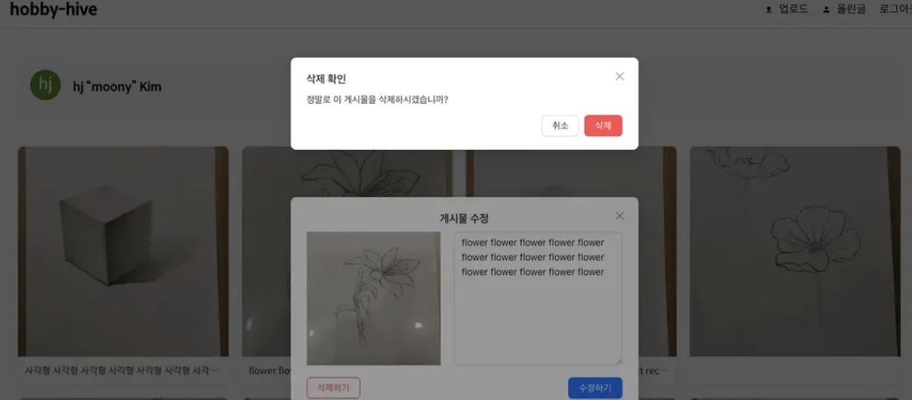

## 프로젝트 소개

나의 취미를 기록하고 공유하는 서비스

## 배포

https://hobby-hive-eight.vercel.app

## 프로젝트 목적

위 배포 링크는 다음 레포에서 Next.js, React 환경에서 작성한것입니다. 

https://github.com/HongJungKim-dev/hobby-hive

이 프로젝트는 vue.js 환경으로 마이그레이션하면서 vue.js를 학습하고 적용해보는 프로젝트입니다.

아래 작성한 캡쳐화면 및 고민한 사항도 위 Next.js레포에서 작성한 내용입니다.

## 기술 스택

- Vue.js, Pinia
- Scss
- Supabase

### 소개 페이지



### 전체 게시물 확인



### 게시물 추가



### 게시물 수정



### 올린 게시물 확인



### 게시물 삭제



## 기능 사항

- 로그인한 사용자는 취미 활동 이미지와 설명을 작성한 게시글을 업로드할 수 있습니다.
- 로그인한 사용자는 취미 활동 게시글을 수정할 수 있습니다.
- 로그인한 사용자는 취미 활동 게시글을 삭제할 수 있습니다.
- 태블릿, 모바일 반응형 레이아웃

## 고민한 사항

1. 캐싱을 이용한 데이터 최적화
   - 데이터를 가져오는데 73ms 소요 되었는데 캐시후 2.4ms 70ms 로 를 단축
   - staleTime을 gcTime 을 보다 짧게 설정하여 데이터가 stale 상태가 된 후에도
     캐시에서 활용하 여 불필요한 refetch를 줄임
2. CI/CD 파이프라인 구축
   - GitHub Actions을 활용해 테스트를 자동화 구현, 안전하게  
      코드를 반영하고 Vercel에 배포하는 CI/CD 파이프라인을 구축
3. 게시물, 모달 컴포넌트 재사용을 통한 코드 중복 최소화
4. 사용자 인증 및 권한 관리 체계 구축
5. 웹접근성 고려
   - 시멘틱 마크업, aria-label, 키보드 네비게이션을 지원

## 시작

```bash
npm run dev
```
